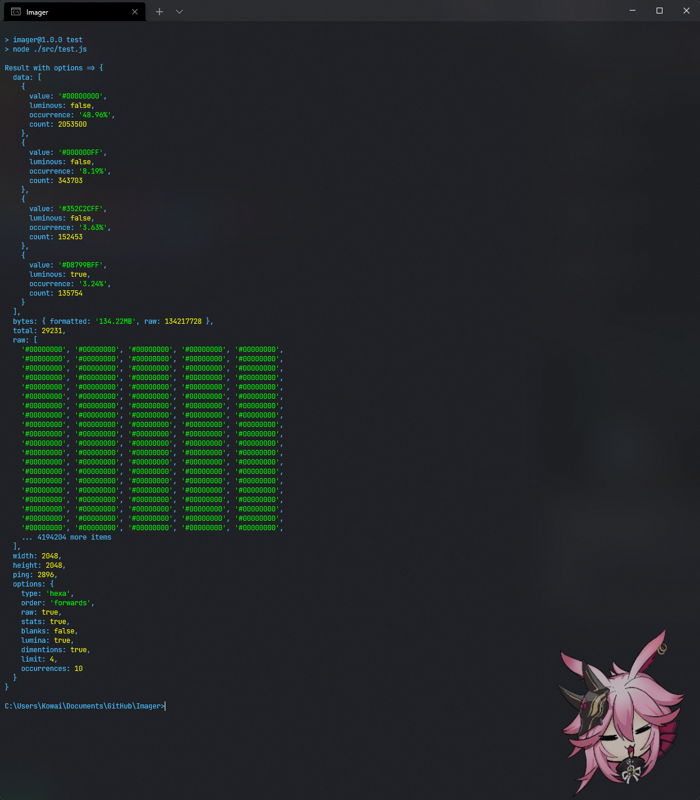
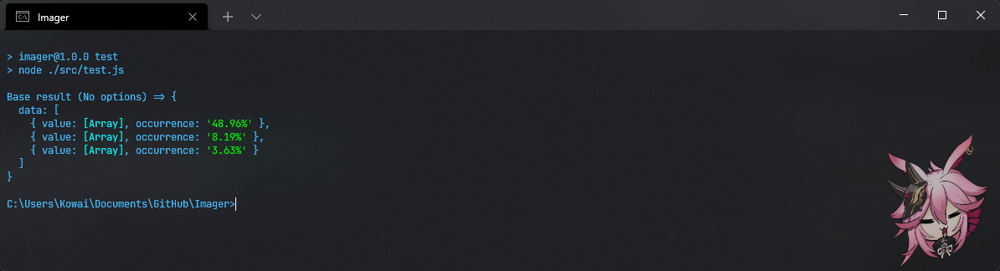
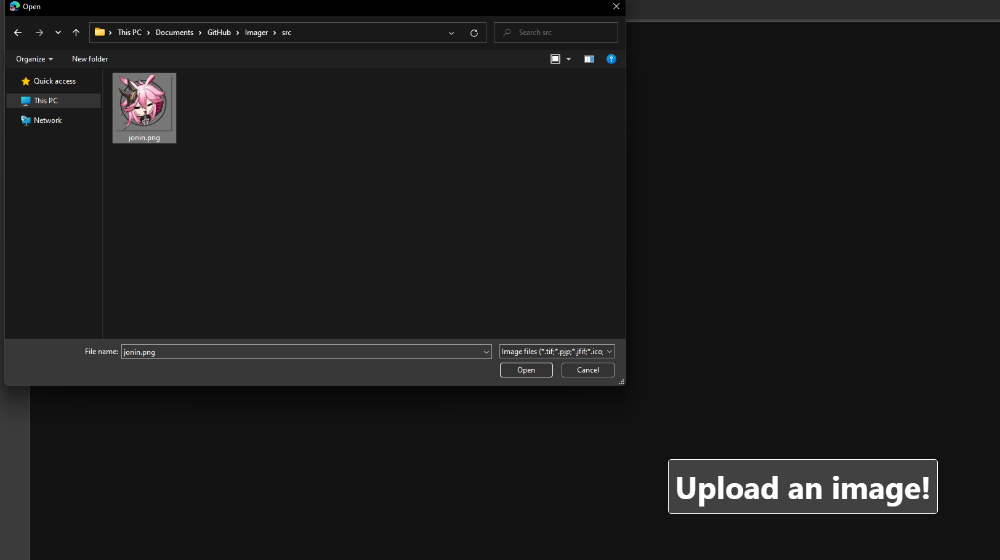
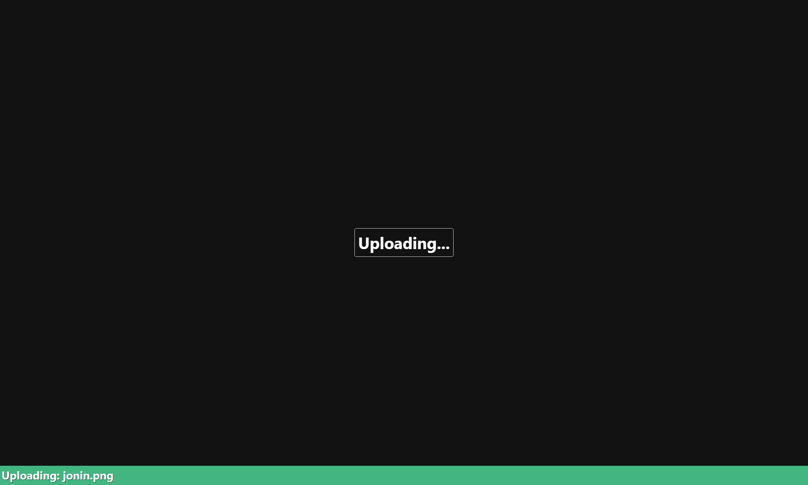
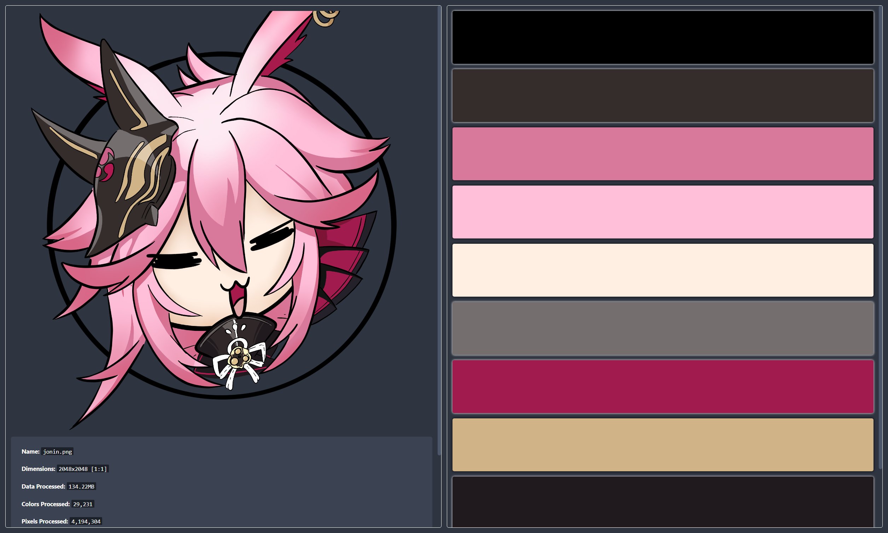
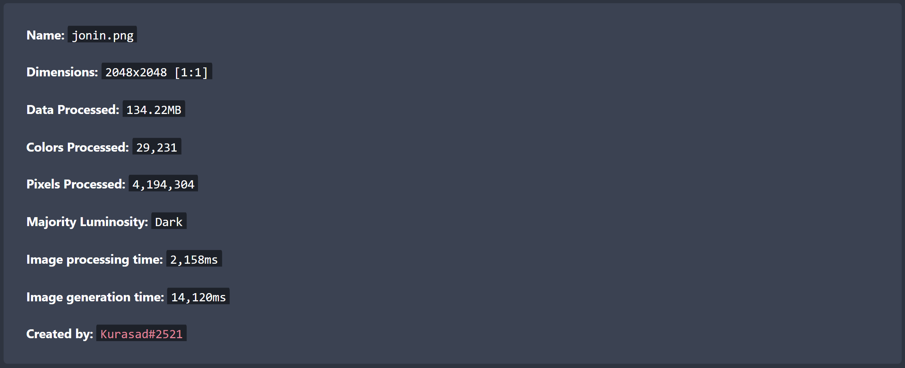
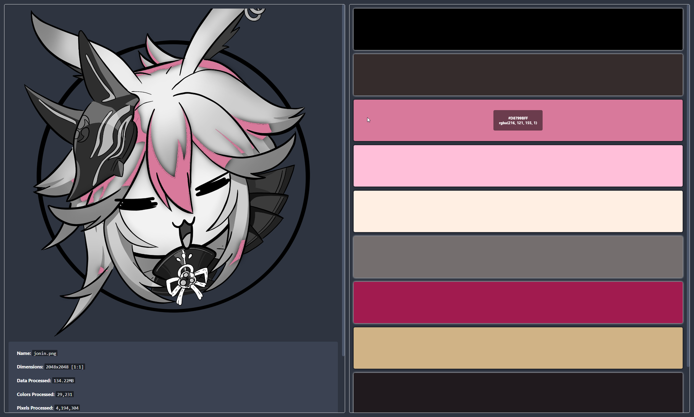
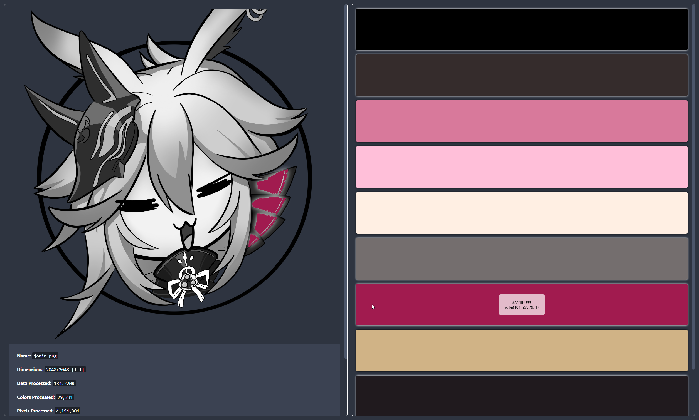
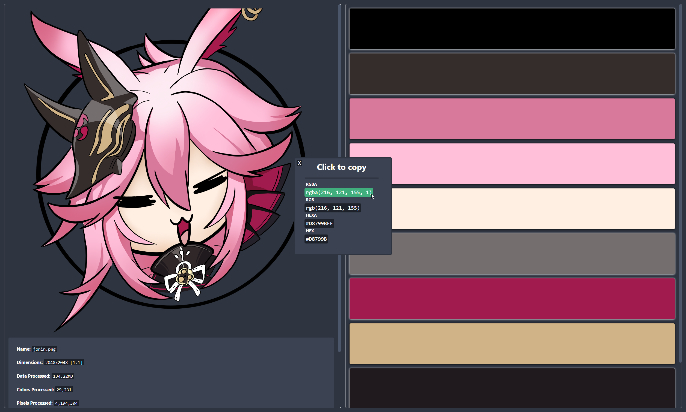

## Imager

### Purpose
This project is a *mostly* JS project that will read image pixels and return data regarding the image.
Why? Because I felt like this would be something cool to try out

### Real world application
This would just be a small little project showcasing how simplie it can be to process image data and create interesting things with it.

### Included items
`src/index.js`: Image parser and data generator.
<br />
`src/test.js`: Example code on how to use this module.
<br />
`api/`: An [Express](https://www.npmjs.com/package/express) example on how this can be used in the real world.

### Result structure
The following is the base result, the least amount of data you can get from the module:
```js
{
  data: [ // An array of top RGBA values (Including transparent pixels).
    {
        value: [0, 0, 0, 0], // A RGBA array [r, b, g, a].
        occurrence: '48.96%' // How often this pixel is found in the image.
    },
    { value: [0, 0, 0, 1], occurrence: '8.19%' },
    { value: [53, 44, 44, 1], occurrence: '3.63%' }
  ]
}
```

The following is a result from a call with paramters, the result is then modified by the module to meet the requirements:
<br />
Options passed:
```js
{
    type: 'hexa', // The format of data you want, options are: rgba, rgb, hexa, hex.
    order: 'forwards', // The order of data returned, forwards = most found values & backwards = least found values.
    raw: true, // Return the raw pixel values in an array.
    stats: true, // Some stats to pass along with the returned data such as ping or bytes of data processed.
    blanks: false, // Ignore fully transparent values in the result [0, 0, 0, 0].
    lumina: true, // Add field in the returned data to see if the value is a light color or dark color.
    dimentions: true, // Return the dimentions of the image.
    limit: 4, // How many values to pass in the result's data field.
    occurrences: 10, // The least number of pixels required for it to be required in the result (Not applicable to paramter: raw).
    // occurrences: '15.00%' // Another option for occurrences (Needs to occur at least X percent in order to be available in result).
}
```
Result:

```js
{
  "data": [ // An array of top HEXA values (Including transparent).
    {
      "value": "#00000000", // HEXA value.
      "luminous": false, // Whether it is a light or dark color.
      "occurrence": "48.96%", // How often this pixel is found in the image.
      "count": 2053500 // The actual number of pixels with this value.
    },
    {
      "value": "#000000FF",
      "luminous": false,
      "occurrence": "8.19%",
      "count": 343703
    },
    {
      "value": "#352C2CFF",
      "luminous": false,
      "occurrence": "3.63%",
      "count": 152453
    },
    {
      "value": "#D8799BFF",
      "luminous": true,
      "occurrence": "3.24%",
      "count": 135754
    }
  ],
  "bytes": { // Byte field is (Enabled with stats).
    "formatted": "134.22MB", // Total bytes in readable format.
    "raw": 134217728 // Total bytes in a raw format.
  },
  "total": 29231, // Total number of colors found on the image.
  "raw": [ // An array of raw values (Takes type as format).
    '#00000000', '#00000000', '#00000000', '#00000000', '#00000000',
    ... 4194204 more items
  ],
  "width": 2048, // Width of image (Enabled with dimentions).
  "height": 2048, // Height of image (Enabled with dimentions).
  "ping": 850, // Image read and generate duration.
  "options": { // Passed options (Enabled with stats).
    "type": "hexa",
    "order": "forwards",
    "raw": false,
    "stats": true,
    "blanks": false,
    "lumina": true,
    "dimentions": true,
    "limit": 4,
    "occurrences": 10
  }
}
```


### Installation
Clone the repo to your local (Requires [GIT](https://git-scm.com/)).
```
git clone https://github.com/DPulavarthy/Imager.git
```

`cd` into the repo folder with:
```
cd Imager
```

Install the dependencies:
```
npm i
```

Quickly test the module:
```
npm test
```

Start the Express server:
```
npm start
```

### Usage
```js
    const Imager = require('imager')
    // OR
    const { Imager } = require('imager')

    await new Imager({...[Params]...}).load("...[File]...")

    //EX:
    const result = await new Imager({
        type: 'hexa',
        dimentions: true,
        limit: 4,
        occurrences: 10
    }).load('./test.png')
```

### About the quick test (npm test)
The quick test will run two scenarios, one with no paramters and one with some parameters.
The one with most parameters enabled will run first and returns the requested data, it will look something like:

Then the result with no parameters will run, which returns the base data the module can send.


### About the Express server (npm start)
The express server is a little website that will take in an image and show information about it:
<br />
Going there for the first time looks something like this:


On this page you can select an image to upload:


Once an image has been selected it can be uploaded to the local server, when it is being processed the page should look like:


The result is a new page where you can view information about the image:


Such as information about the image:


Light colors will have a dark background and dark colors will have a light background, to keep the content easy to understand, more screenshots below:



Click on any color cell to get a popup which will allow you to copy that color's information:


### Notes
**TODO:**
* Add a range field (Pixel grouping).
